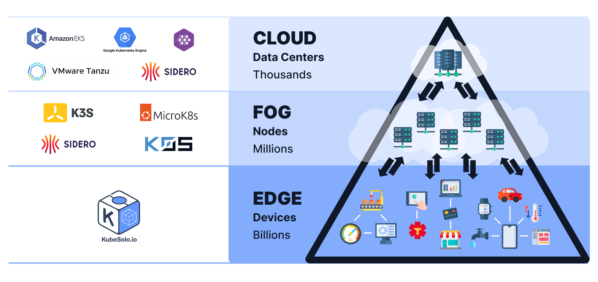

# kubesolo 

Ultra-lightweight, OCI-compliant, single-node Kubernetes built for constrained environments. No clustering. No etcd. Just what you need to run real workloads on real hardware.

## Overview

KubeSolo is designed for devices at the farthest layer of the network, such as IoT, IIoT, and embedded systems. The image illustrates the three main layers of modern distributed infrastructure:
1. Cloud (Data Centers)
Scale: Thousands of nodes
Examples: Amazon EKS, Google Kubernetes Engine, VMware Tanzu, Sidero
Purpose: Centralized, large-scale compute and storage
2. FOG (Distributed Nodes)
Scale: Millions of nodes
Examples: K3s, MicroK8s, Sidero, K0S
Purpose: Distributed compute closer to the edge, often for latency-sensitive or regional workloads
3. Edge (Devices)
Scale: Billions of devices
Example: KubeSolo
Purpose: Ultra-lightweight Kubernetes for resource-constrained environments (IoT gateways, industrial controllers, smart devices, etc.)
KubeSolo sits at the very bottom of this stack, providing a simple, single-node Kubernetes experience for the edge, where minimal resources and offline operation are critical.



## What is this?

KubeSolo is a production-ready single-node Kubernetes distribution with the following changes:

* It is packaged as a single binary
* It uses SQLite (via Kine) as the default storage backend
* It wraps Kubernetes and other components in a single, simple launcher
* It is secure by default with reasonable defaults for lightweight environments
* It has minimal OS dependencies (just a sane kernel and cgroup mounts needed)
* It eliminates the need for complex multi-node setup by providing a single-node solution

KubeSolo bundles the following technologies together into a single cohesive distribution:

* containerd & runc for container runtime
* CoreDNS for DNS resolution
* Kine for SQLite-based storage

## What's with the name?

KubeSolo is designed to be a single-node Kubernetes distribution, hence the "Solo" in the name. It's meant to be simple, lightweight, and perfect for development, testing, or small production workloads that don't require the complexity of a multi-node cluster.

## Is this a fork?

No, it's a distribution. A fork implies continued divergence from the original. This is not KubeSolo's goal or practice. KubeSolo explicitly intends not to change any core Kubernetes functionality. We seek to remain as close to upstream Kubernetes as possible by leveraging the k3s forked Kubernetes. However, we maintain a small set of patches important to KubeSolo's use case and deployment model.

## How is this lightweight or smaller than upstream Kubernetes?

There are three major ways that KubeSolo is lighter weight than upstream Kubernetes:

* The memory footprint to run is smaller
* The binary, which contains all the non-containerized components needed to run a cluster, is smaller
* The Kubernetes Scheduler does not exist, instead, it is replaced by a custom Webhook called `NodeSetter`

The memory footprint is reduced primarily by:

* Running many components inside of a single process
* Using SQLite instead of `etcd`
* Optimizing resource limits for single-node usage
* Replacing the Kubernetes Scheduler with `NodeSetter` 

## Why is the binary size big compared to other distributions?

KubeSolo is designed specifically for IoT or IIoT devices, such as embedded systems, which typically lack internet connectivity. To address this limitation, KubeSolo is equipped with all the necessary components to ensure it is offline ready.

## Getting Started

### Quick Install

```bash
# Download and install KubeSolo
curl -sfL https://get.kubesolo.io | sudo sh -
```

A kubeconfig file is written to `/var/lib/kubesolo/pki/admin/admin.kubeconfig` and the service is automatically started.

## Flags

KubeSolo supports the following command-line flags:

| Flag | Environment Variable | Description | Default |
|------|-------------|---------|
| `--path` | `KUBESOLO_PATH` | Path to the directory containing the kubesolo configuration files | `/var/lib/kubesolo` |
| `--portainer-edge-id` | `KUBESOLO_PORTAINER_EDGE_ID` | Portainer Edge ID | `""` |
| `--portainer-edge-key` | `KUBESOLO_PORTAINER_EDGE_KEY` | Portainer Edge Key | `""` |
| `--portainer-edge-async` | `KUBESOLO_PORTAINER_EDGE_ASYNC` | Enable Portainer Edge Async Mode | `false` |
| `--local-storage` | `KUBESOLO_LOCAL_STORAGE` | Enable local storage | `true` |
| `--debug` | `KUBESOLO_DEBUG` | Enable debug logging | `false` |
| `--pprof-server` | `KUBESOLO_PPROF_SERVER` | Enable pprof server for profiling | `false` |

## Documentation

Please see the [documentation](https://kubesolo.io/documentation) for complete documentation.

## Community

### Getting involved

GitHub Issues - Submit your issues and feature requests via GitHub.

## Release cadence

KubeSolo maintains pace with upstream Kubernetes releases but rely on the forked version from `k3s`. Our goal is to release patch releases within one week, and new minors within 30 days.

## Contributing

TBC

## Security

Security issues in KubeSolo can be reported by sending an email to security@portainer.io.

## TradeMark

KubeSolo and the KubeSolo logo are registered trademarks of Portaner.io Limited