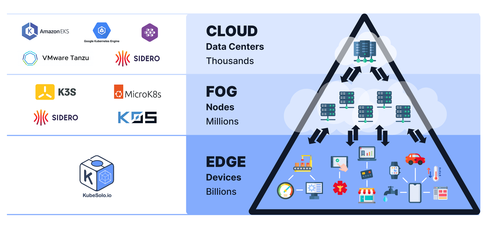

# KubeSolo

Anywhere you'd run Docker or Podman, you can now run Kubernetes. Ultra-lightweight, OCI-compliant, single-node Kubernetes, under 200 MB RAM. No etcd. No clustering overhead.

## Overview

Standard Kubernetes is built for multi-node clusters, and a lot of the real world runs on single nodes. Edge devices. Factory gateways. Developer laptops. Remote site hardware. IoT controllers. The millions of machines that have been running Docker or Podman because standing up a full cluster was overhead that couldn't be justified for a single workload host.

That creates a gap. You either run Docker and give up the Kubernetes ecosystem entirely, or you run K3s or MicroK8s and accept that you're carrying clustering machinery you'll never use. KubeSolo closes the gap by taking a different starting position: remove the clustering code rather than disable it.

The result is full Kubernetes, complete API, full control loop, full ecosystem compatibility, with a RAM footprint under 200 MB, optimized for flash storage, and an install that takes under 60 seconds on hardware from a Raspberry Pi to an industrial gateway.



## What is this?

KubeSolo takes Kubernetes and removes everything that only makes sense when there's more than one node: etcd quorum logic, leader election, multi-node networking overlays, control plane distribution. None of it is present, not disabled, removed.

What remains is a full Kubernetes control loop running in a single process. The API server, controller manager, and kubelet all run together. Your existing manifests, Helm charts, and CRDs work without modification.

The design target is anywhere you would have previously reached for Docker or Podman: edge devices, factory hardware, developer laptops, remote sites, IoT gateways, kiosk machines. Same OCI images, better runtime, full ecosystem.

KubeSolo bundles the following technologies together into a single cohesive distribution:

* containerd & crun for container runtime
* CoreDNS for DNS resolution
* Kine for SQLite-based storage (replacing etcd)

It is packaged as a single binary with minimal OS dependencies (a sane kernel and cgroup mounts), secure defaults tuned for lightweight environments, and all required components bundled for offline operation.


## How is this lightweight or smaller than upstream Kubernetes?

KubeSolo's footprint sits under 200 MB RAM because clustering machinery is absent, not dormant. Most lightweight Kubernetes distributions slim down a full distribution; the multi-node code is still there, just inactive. KubeSolo starts from the other end: everything that requires more than one node has been removed.

Three specific design decisions contribute to the smaller footprint:

* No etcd; SQLite (via Kine) replaces it as the state store
* No Kubernetes Scheduler; replaced by `NodeSetter`, a lightweight mutating admission webhook built into KubeSolo that sets `spec.nodeName` on every new pod, without the full scheduling machinery
* All components run inside a single process rather than as separate binaries

The practical result is a full Kubernetes control loop that runs comfortably on devices with 512 MB of RAM, on flash storage, and in air-gapped environments.

## Why is the binary size big compared to other distributions?

KubeSolo ships in two variants to suit different deployment environments:

| Variant | Binary size | Internet required | Use when |
|---------|-------------|-------------------|----------|
| **Online** (default) | Smaller | Yes | Devices with reliable internet access where binary size matters more than offline capability |
| **Offline** | Larger | No | Air-gapped environments, factory floors, edge devices with intermittent or no connectivity |

The offline variant bundles all required container images, CNI plugins, and runtime dependencies directly in the binary. Nothing needs to be fetched from the internet at install or runtime. The online variant pulls container images from public registries at startup, keeping the binary smaller at the cost of requiring internet access.

The default installer downloads the online variant. If your devices are air-gapped or have unreliable internet access, use the offline variant.

## Getting Started

### Quick Install

> [!WARNING]
> Ensure that no container engine (e.g., Docker, Podman, containerd) is installed or active on the target system prior to proceeding. This includes any background services or residual installations that could interfere with KubeSolo networking. The installer refuses to continue if Docker is installed or running.
>
> The one exception is deliberate: KubeSolo can attach to a host-managed containerd or CRI-O instead of running its own, by setting `runtime.endpoint` (for example `unix:///run/containerd/containerd.sock`). The host then provides the runtime, the OCI runtime, the CNI plugin binaries and the sandbox image.

**Supported platforms:** ARM · ARM64 · x86\_64 · RISC-V 64

**Step 1, Install:** Run the install script with sudo. KubeSolo starts as a systemd service.

The installer detects your architecture and libc automatically. Choose the variant that matches your environment:

**Online** (default, smaller binary, pulls container images from registries at startup):

```bash
curl -sfL https://get.kubesolo.io | sudo sh -
```

**Offline** (larger binary with all images bundled, no internet required at runtime):

```bash
curl -sfL https://get.kubesolo.io | KUBESOLO_OFFLINE=true sudo -E sh -
```

**Air-gapped** (no internet on the target machine at all):

```bash
# On a connected machine with the same architecture, download the offline bundle
curl -sfL https://get.kubesolo.io | sh -s -- --offline --download-only=/tmp/kubesolo-bundle

# Transfer the files to the target machine, then install
sudo sh install.sh --offline-install=<archive.tar.gz>
```

The installer writes your settings to `/etc/kubesolo/config.yaml`. Every installer flag is listed in the [install script flags reference](docs/installation/flags.md). Unreleased changes from the `develop` branch are served from `https://get-dev.kubesolo.io`; don't use it in production.

The installer also detects your libc variant:
- **glibc systems** (Ubuntu, CentOS, Debian, etc.): Downloads standard binary
- **musl systems** (Alpine Linux): Downloads musl-compatible binary

**Step 2, Set up kubectl:** Copy the admin kubeconfig from `/var/lib/kubesolo/pki/admin/admin.kubeconfig` to the machine where kubectl is installed, then set the context:

```bash
kubectl config use-context kubernetes-admin@kubesolo
kubectl get nodes
# You should see a single node in Ready state
```

**Step 3, Deploy your first workload:**

```bash
kubectl apply -f https://raw.githubusercontent.com/portainer/kubesolo/develop/examples/mosquitto.yaml
kubectl get all -n mosquitto
```

**Note:** If you're running KubeSolo on a device with less than 512 MB of RAM, interact with the cluster using an externally installed `kubectl`.

### kubesoloctl (CLI)

`kubesoloctl` is a single, dependency-free binary that manages the full KubeSolo lifecycle — install, upgrade, reset, uninstall, and kubeconfig wiring — and adds a **container mode** for running KubeSolo on macOS, Windows (WSL2), or any Linux host with a container engine. It's the recommended way to spin up KubeSolo for local development and CI.

Download the binary for your platform from the [releases page](https://github.com/portainer/kubesolo/releases) (`kubesoloctl-<os>-<arch>`), put it on your `PATH`, then:

```bash
# Linux host (runs as a system service):
sudo kubesoloctl install

# Container mode — macOS / WSL2 / Linux dev (requires a container engine):
kubesoloctl install --run-mode=container

# Then, regardless of mode:
kubectl get nodes --watch
```

`install` runs pre-flight checks, starts KubeSolo, and merges the admin kubeconfig into `~/.kube/config` automatically. In container mode you can publish workload ports just like Kind:

```bash
kubesoloctl install --run-mode=container --container-ports=9001,8080:80,9000-9100
```

For the full command reference, run modes, container-port syntax, multi-instance usage, and offline bundles, see the [kubesoloctl guide](docs/installation/kubesoloctl.md).

### Advanced Installation

For detailed installation instructions including support for industrial devices, embedded systems, different init systems, and custom configurations, see the [Installation Guide](INSTALL.md).

The installation guide covers:
- Universal installer with automatic init system detection
- Minimal installer for constrained environments  
- Service management across different platforms
- Industrial device considerations (read-only filesystems, limited storage, air-gapped installations)
- Corporate proxy support for environments behind firewalls
- Architecture-specific installations

## Configuration

KubeSolo reads its settings from `/etc/kubesolo/config.yaml`:

```yaml
apiVersion: kubesolo.io/v1alpha1
kind: Config

network:
  nodeIP: 10.0.0.5
portainer:
  edgeID: "..."
  edgeKey: "..."
d2k:
  enabled: true
```

Anything omitted falls back to its default. Settings are read at startup, so a
change takes effect on restart.

```bash
kubesoloctl config get                              # show everything
sudo kubesoloctl config set network.nodeIP 10.0.0.5 # change one setting
sudo kubesoloctl config edit                        # open in $EDITOR
kubesoloctl config schema                           # every setting and its default (YAML)
```

KubeSolo can also serve the file over a unix socket, so it can be managed
programmatically.

- **[Configuration file](docs/configuration/config-file.md)** — every setting, precedence, migrating from flags
- **[Configuration API](docs/configuration/config-api.md)** — managing it over a socket
- **[Grafana dashboards](examples/grafana/README.md)** — pre-built dashboards for API server, kubelet, cAdvisor and Go runtime metrics

### Migrating from flags

Run the binary with the flags your service currently passes, plus
`--print-config`, and save the result:

```bash
sudo kubesolo <current flags> --print-config | sudo tee /etc/kubesolo/config.yaml
```

`kubesoloctl upgrade` does this for you.

## Flags

> **Deprecated.** Command-line flags still work and still override the
> configuration file, so existing installs keep running, but no new flags will be
> added and new settings are configurable only through the file. Each flag and
> its `KUBESOLO_*` environment variable is listed against its setting in the
> [flag-to-setting table](docs/configuration/config-file.md#flag-and-environment-variable-equivalents).
> Flags for the install script are in the [installer flags reference](docs/installation/flags.md).

Two flags are not settings and have no equivalent in the file: `--config`, which
names it, and `--print-config`, which prints the resolved document and exits.

Example:

To connect KubeSolo to Portainer as an Edge agent, pass the Edge ID and key to the installer. They are written to `portainer.edgeID` and `portainer.edgeKey` in the configuration file:

```bash
curl -sfL https://get.kubesolo.io | KUBESOLO_PORTAINER_EDGE_ID=your-portainer-edge-id KUBESOLO_PORTAINER_EDGE_KEY=your-portainer-edge-key sudo -E sh
```

On an existing install, set them in the file instead and restart:

```bash
sudo kubesoloctl config set portainer.edgeID your-portainer-edge-id
sudo kubesoloctl config set portainer.edgeKey your-portainer-edge-key
```

## Documentation

Full documentation is at [kubesolo.io](https://kubesolo.io/documentation). The guides in this repository:

**Installing**

- [Installation guide](INSTALL.md): init systems, minimal installer, industrial devices, proxies, uninstalling
- [Install script flags](docs/installation/flags.md): every `install.sh` flag, install channels, air-gapped bundles
- [kubesoloctl](docs/installation/kubesoloctl.md): the CLI, including container mode for macOS, WSL2 and CI

**Configuring**

- [Configuration file](docs/configuration/config-file.md): every setting, its default, and the flag it replaces
- [Configuration API](docs/configuration/config-api.md): reading and changing settings over a unix socket
- [Example configuration](examples/kubesolo-config.yaml): every setting at its default, ready to copy
- [Container mode](docs/configuration/container-mode.md): running KubeSolo itself in a container
- [CPU pinning](docs/configuration/cpu-pinning.md): exclusive cores for latency-sensitive workloads
- [d2k](docs/configuration/d2k.md): a Docker-compatible API endpoint on the node
- [Registry configuration](docs/configuration/registry.md): mirrors, private registries and custom TLS
- [Installing a CNI (Cilium)](docs/configuration/cni.md): running an external CNI on a single KubeSolo node

**Monitoring**

- Metrics endpoint: set `metrics.enabled: true` to serve Prometheus metrics for the control plane at `/metrics` on `127.0.0.1:9105` (change with `metrics.bindAddress`). It is off by default.
- [Grafana dashboards](examples/grafana/README.md): pre-built dashboards for API server, kubelet, cAdvisor and Go runtime metrics (scraped from Kubernetes, not from the KubeSolo metrics endpoint)

**Using a host container runtime**

By default KubeSolo runs its own embedded containerd. Set `runtime.endpoint` (flag `--container-runtime-endpoint`) to a host-managed containerd or CRI-O socket, such as `unix:///run/crio/crio.sock`, and KubeSolo attaches to it instead. The host is then responsible for the runtime, the OCI runtime, the CNI plugin binaries and the sandbox image.

## Building from Source

### Prerequisites

- Go 1.26.5 or later (see `go.mod`)
- Docker (for ARM builds and dependency management)
- Cross-compilation toolchains (optional, for cross-platform builds)

### Install Cross-Compilation Toolchains

To build for multiple architectures, install the required cross-compilation toolchains:

```bash
sudo make install-cross-compilers
```

This installs (on Debian/Ubuntu, via `apt-get`):
- `gcc-aarch64-linux-gnu` (for ARM64)
- `gcc-x86-64-linux-gnu` (for AMD64)
- `gcc-arm-linux-gnueabihf` (for ARM/ARMHF)
- `gcc-riscv64-linux-gnu` (for RISCV64)

### Basic Build

Build for your current platform (outputs to `./dist/kubesolo`):

```bash
make build
```

### Cross-Platform Builds

Build for specific architectures using environment variables:

```bash
# Build for ARM64
make build GOARCH=arm64

# Build for AMD64  
make build GOARCH=amd64

# Build for ARM (ARMHF)
make build GOARCH=arm

# Build for RISCV64
make build GOARCH=riscv64
```

### Alpine Linux / musl Builds

For Alpine Linux compatibility, build musl-compatible static binaries:

```bash
# Install musl cross-compilers (one-time setup)
sudo make install-musl-cross-compilers

# Build musl binary for specific architecture
make build-musl GOARCH=amd64
make build-musl GOARCH=arm64
make build-musl GOARCH=arm
make build-musl GOARCH=riscv64

# Build all supported musl architectures
make build-all-musl
```

`install-musl-cross-compilers` installs `musl-tools` and the musl.cc toolchains for `amd64`, `arm64`, `arm` (`musleabihf`) and `riscv64`.

### Offline Builds

The offline variant embeds every container image. Build it with `make build-offline` (glibc) or `make build-musl-offline` (musl); both take the same `GOARCH` and `OUTPUT` variables.

### kubesoloctl

`kubesoloctl` is pure Go (`CGO_ENABLED=0`), so it needs no cross-compiler and one binary per architecture runs on both glibc and musl:

```bash
# Linux, host architecture (outputs to ./dist/kubesoloctl-<os>-<arch>)
make build-kubesoloctl

# Another platform
make build-kubesoloctl GOOS=darwin GOARCH=arm64

# All released targets: linux amd64/arm64/arm/riscv64, darwin amd64/arm64
make build-kubesoloctl-all
```

### Custom Output Path

Specify a custom output path using the `OUTPUT` variable:

```bash
# Custom filename
make build OUTPUT=./kubesolo-custom

# Platform-specific naming
make build GOARCH=arm OUTPUT=./dist/kubesolo-arm

# Different directory
make build OUTPUT=./bin/kubesolo
```

### Combined Examples

```bash
# Build ARM binary with custom name
make build GOARCH=arm OUTPUT=./dist/kubesolo-linux-arm

# Build AMD64 binary for CI/CD
make build GOARCH=amd64 OUTPUT=./artifacts/kubesolo-linux-amd64
```

### Development

For development and testing, you can run KubeSolo directly without building:

```bash
# Download dependencies first (only needed once)
make deps

# Run KubeSolo in development mode
make dev
```

### Notes

- **ARM builds**: For ARM architecture, containerd binaries are built using Docker cross-compilation for optimal compatibility
- **Dependencies**: The build process automatically downloads required dependencies (containerd, runc, CNI plugins) for the target architecture
- **CGO**: All builds use CGO for better performance and compatibility with system libraries

## Community

### Getting involved

[GitHub Issues](https://github.com/portainer/kubesolo/issues), submit issues and feature requests.

[GitHub](https://github.com/portainer/kubesolo), browse source, open pull requests, and contribute.

## Security

Security issues in KubeSolo can be reported by sending an email to security@portainer.io.

## Trademark

KubeSolo and the KubeSolo logo are trademarks of [Portainer.io Limited](https://portainer.io). Released under the [MIT license](https://opensource.org/licenses/MIT).